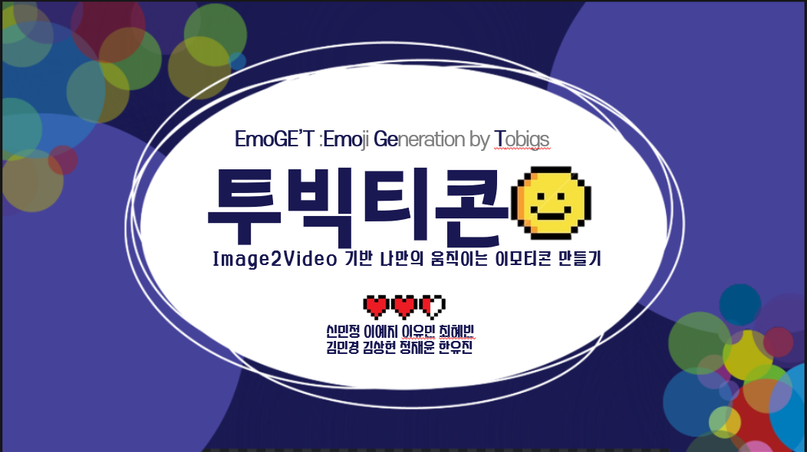
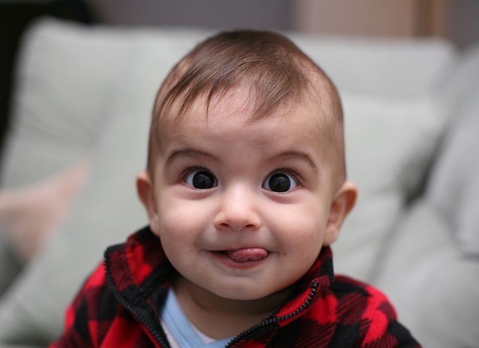
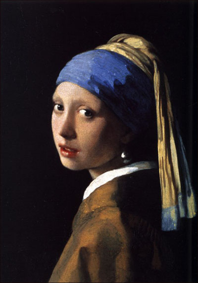
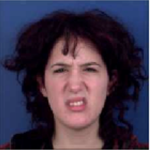
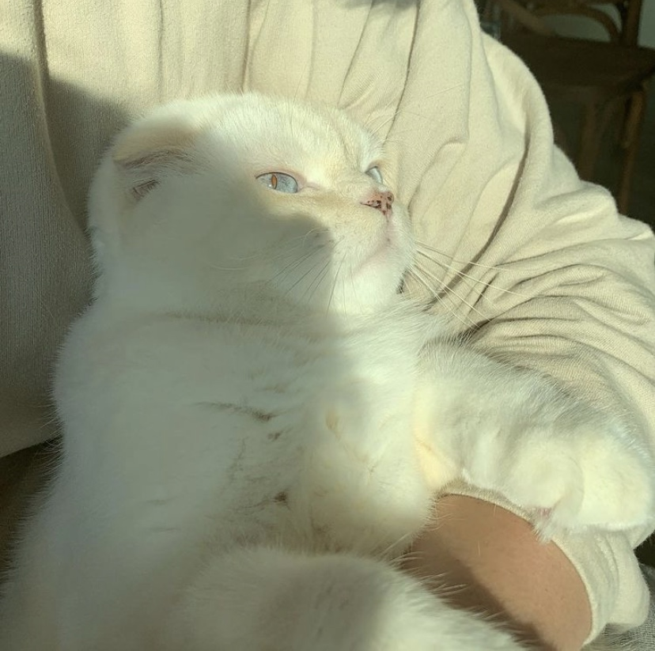

# 🙂Moving-Emoji-Generation🤥

## 투빅티콘 - Image2Video 기반 나만의 움직이는 이모티콘 생성

투빅티콘은 GAN based image2video 방법을 활용한 나만의 움직이는 이모티콘 생성을 제공하는 서비스입니다.

## Notice

EmoGE'T(Emoji GEneratied by Tobigs)은 투빅스 8명의 멤버가 모여 image2video 기반 프로젝트를 진행한 팀입니다.

투빅스 제 11회 컨퍼런스에서 시연한 웹 페이지는 [Demo web page]("www.google.com")입니다.

투빅티콘으로 자신의 움직이는 이모티콘을 만들어보세요 !
투빅티콘에서는 아래와 같은 옵션이 있습니다. 

이모지 스타일 선택
| Animation  |  Babyface | Painting  | 
|---|---|---|
|   |   |   | 

이모지 감정 선택
| Happiness  |  Disgusted | Surprise  | 
|---|---|---|
|   |   |   | 

위의 옵션에 따라, 학습된 모델이 나만의 움직이는 이모티콘을 만들어 줍니다.

## Requirements

We have tested on:

- CUDA 11.0
- python 3.8.5
- pytorch 1.7.1
- numpy 1.19.2
- opencv-python  4.5.1
- dlib 19.21.1
- scikit-learn 0.24.0
- Pillow 8.1.0
- Ninja 1.10.0
- glob2 0.7

## Usage

### Generate your own Emoji

You can generate your own moving emoticon :)

> python emoticon_generate.py --file ImagePath --transform Animation --emotion Emotion --type OutputType --model Approach

For example,
> python emoticon_generate.py --file 00001.jpg --transform baby --emotion disgusted --type mp4 --model sol1

### Training

Train the landmark generation model using sol1 approach

> python sol1/main.py --data_path DataPath --conditions Conditions

Train the landmark generation model using sol2 approach

> python sol2/train.py --image_discriminator PatchImageDiscriminator --video_discriminator CategoricalVideoDiscriminator --dim_z_category 3 --video_length 16  

Generate the predicted landmarks using sol2 model

> python sol2/generate_videos.py [model path] [image] [class] [save_path]

## Pretrained Checkpoints

[Animation]()
[Baby]()
[Painting]()

## Samples

 
 
 

## Reference
- Rosinality, stylegan2-pytorch,  2019, [https://github.com/rosinality/stylegan2-pytorch](https://github.com/rosinality/stylegan2-pytorch)
- PieraRiccio, stylegan2-pytorch, 2019, [https://github.com/PieraRiccio/stylegan2-pytorch](https://github.com/PieraRiccio/stylegan2-pytorch)
- justinpinkney, toonify, 2020, [https://github.com/justinpinkney/toonify](https://github.com/justinpinkney/toonify)
- marsbroshok, face-replace, 2016, https://github.com/marsbroshok/face-replace
- sergeytulyakov, mocogan, 2017, https://github.com/sergeytulyakov/mocogan
- Yaohui Wang, Piotr Bilinski, Francois Bremond, Antitza Dantcheva. ImaGINator: Conditional Spatio-Temporal GAN for Video Generation. 2019.

## Contributor 🌟
<!-- ALL-CONTRIBUTORS-LIST:START - Do not remove or modify this section -->
<!-- prettier-ignore-start -->
<!-- markdownlint-disable -->

<table>
  <tr>
    <td align="center"><a href="https://github.com/minjung-s"> <b>MinJung Shin</b></td>
    <td align="center"><a href="https://github.com/yourmean"> <b>YuMin Lee</b></td>
    <td align="center"><a href="https://github.com/simba-pumba"> <b>YeJi Lee</b></td>
    <td align="center"><a href="https://github.com/lilly9117"> <b>Hyebin Choi</b></td>
  </tr>
</table>

<table>
  <tr>
    <td align="center"><a href="https://github.com/minkyeong"> <b>MinKyeong Kim</b></td>
    <td align="center"><a href="https://github.com/shkim960520"> <b>SangHyun Kim</b></td>
    <td align="center"><a href="https://github.com/Jeong-JaeYoon"> <b>JaeYoon Jeong</b></td>
    <td align="center"><a href="https://github.com/Yu-Jin22"> <b>YuJin Han</b></td>
  </tr>
</table>
