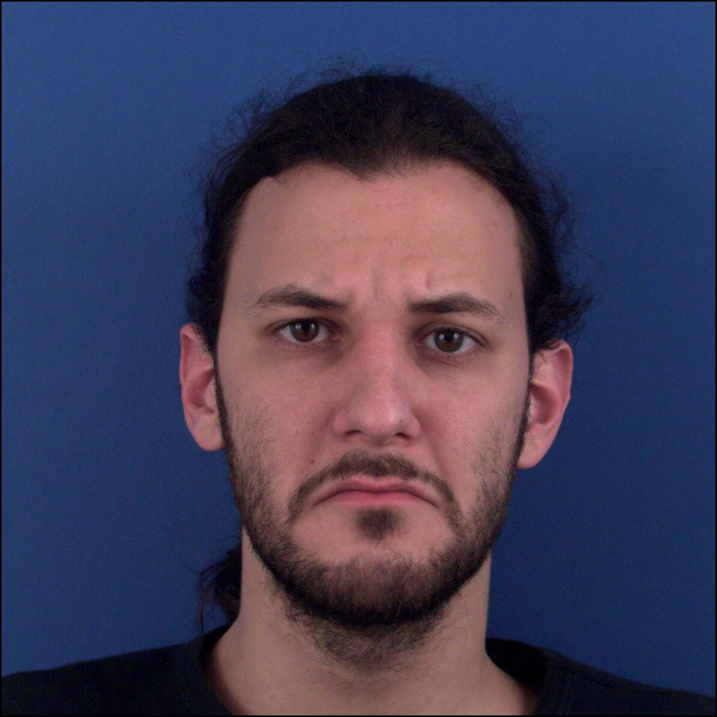

# 🙂Moving-Emoji-Generation🤥

## 투빅티콘 - Image2Video 기반 나만의 움직이는 이모티콘 생성

투빅티콘은 GAN based image2video 방법을 활용한 나만의 움직이는 이모티콘 생성을 제공하는 서비스입니다.

## Notice

EmoGE'T(Emoji GEneratied by Tobigs)은 투빅스 8명의 멤버가 모여 image2video 기반 프로젝트를 진행한 팀입니다.

투빅스 제 11회 컨퍼런스에서 시연한 웹 페이지는 [Demo web page]("www.google.com")입니다.

투빅티콘으로 자신의 움직이는 이모티콘을 만들어보세요 !
투빅티콘에서는 아래와 같은 옵션이 있습니다. 

이모지 스타일 선택
| Animation  |  Babyface | Painting  | 
|---|---|---|
|   |   |   | 

이모지 감정 선택
| Happiness  |  Disgusted | Sadness  | 
|---|---|---|
|   |   |   | 

위의 옵션에 따라, 학습된 모델이 나만의 움직이는 이모티콘을 만들어 줍니다.

## Requirements

We have tested on:

- CUDA 11.0
- python 3.8.5
- pytorch 1.7.1
- numpy 1.19.2
- opencv-python  4.5.1
- dlib 19.21.1
- scikit-learn 0.24.0
- Pillow 8.1.0
- Ninja 1.10.0
- glob2 0.7

## Usage

### Generate your own Emoji

You can generate your own moving emoticon :)

> python emoticon_generate.py --file ImagePath --transform Animation --emotion Emotion --type OutputType --model Approach

For example,
> python emoticon_generate.py --file 00001.jpg --transform baby --emotion disgusted --type mp4 --model sol1

### Training

Train the landmark generation model using sol1 approach

> python sol1/main.py --data_path DataPath --conditions Conditions

Generate the predicted landmarks using sol1 model

> python so1/generate_videos.py [model path] [image] [class] [save_path]

Train the landmark generation model using sol2 approach

> python sol1/train.py --image_discriminator PatchImageDiscriminator --video_discriminator CategoricalVideoDiscriminator --dim_z_category 3 --video_length 16  

Generate the predicted landmarks using sol2 model

> python so1/generate_videos.py [model path] [image] [class] [save_path]

## Samples

   

## Contributor 🌟

| 13기  |   |   |   |
|---|---|---|---|
| [신민정]("[https://google.com](https://github.com/minjung-s)") |  [이유민]("[https://github.com/yourmean](https://github.com/yourmean)") |  [이예지]("[https://github.com/simba-pumba](https://github.com/simba-pumba)") |  [최혜빈]("[https://github.com/lilly9117](https://github.com/lilly9117)") |
|   |   |   |   |

| 14기  |   |   |   |
|---|---|---|---|
| [김민경]("[https://github.com/mink7878](https://github.com/mink7878)")  |  [김상현]("[https://github.com/shkim960520](https://github.com/shkim960520)") |  [정재윤]("[https://github.com/Jeong-JaeYoon](https://github.com/Jeong-JaeYoon)) |  [한유진]("[https://github.com/Yu-Jin22](https://github.com/Yu-Jin22)") |

|   |   |   |   |

## Thanks
- 투빅스 12기 김수아님
  

## Reference

- [https://github.com/rosinality/stylegan2-pytorch](https://github.com/rosinality/stylegan2-pytorch)
- [https://github.com/PieraRiccio/stylegan2-pytorch](https://github.com/PieraRiccio/stylegan2-pytorch)
- [https://github.com/justinpinkney/toonify](https://github.com/justinpinkney/toonify)
- [https://github.com/marsbroshok/face-replace](https://github.com/marsbroshok/face-replace)
- [https://github.com/sergeytulyakov/mocogan](https://github.com/sergeytulyakov/mocogan) # sol2팀 확인좀요
- Yaohui Wang, Piotr Bilinski, Francois Bremond, Antitza Dantcheva. ImaGINator: Conditional Spatio-Temporal GAN for Video Generation. 2019. # sol2팀 확인좀요

